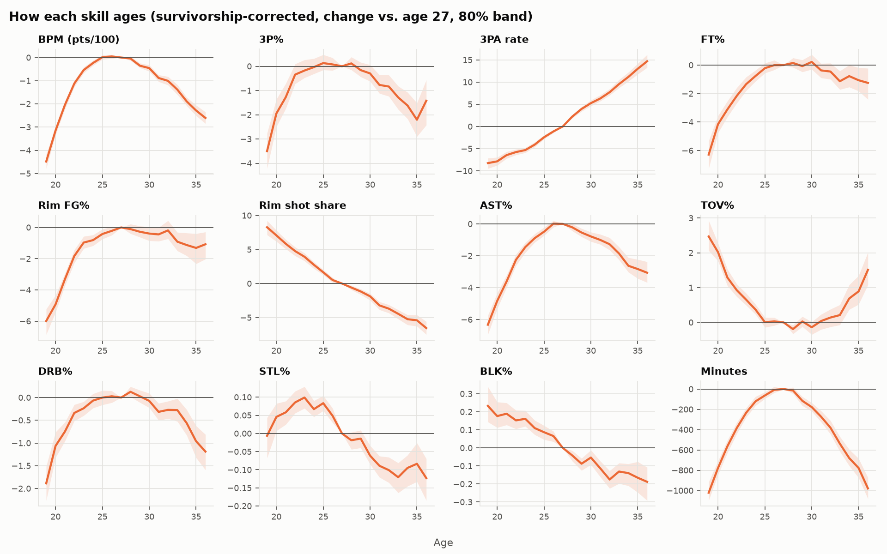
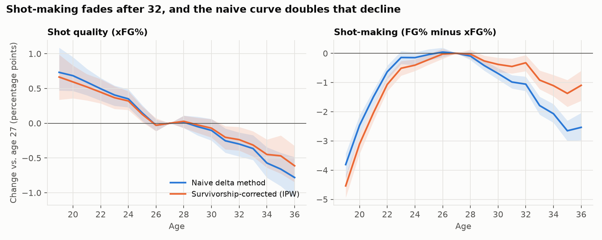
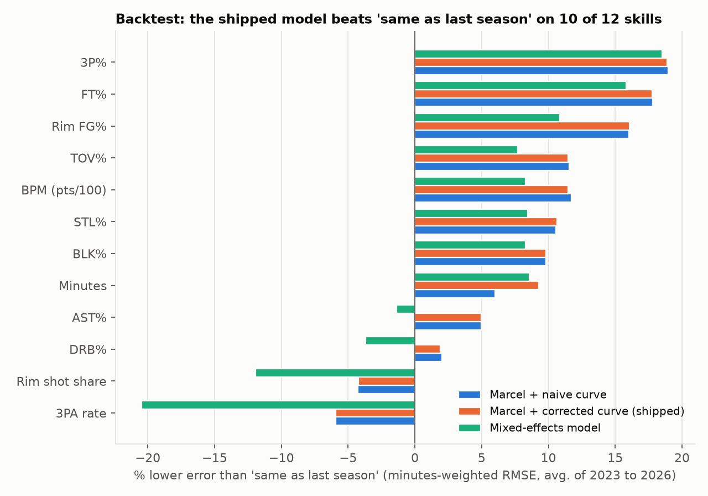
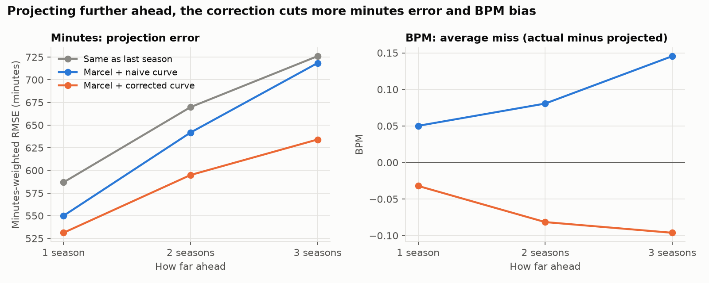
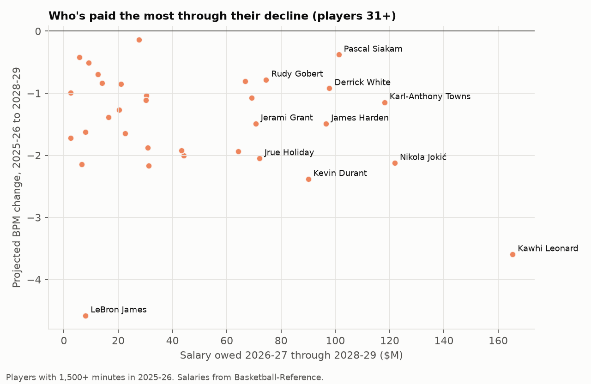

# How NBA Players Age, and What to Expect Through 2028-29

[](https://github.com/rustin-khaz/nba-aging/actions/workflows/tests.yml)

I built aging curves for 12 basketball skills across 26 seasons (2000-01 through 2025-26), corrected them for survivorship bias, and used them to project every player one, two and three seasons ahead with 80% intervals. Then I backtested the projections against seasons that already happened, to see whether any of it actually works. On top of that there's an expected-FG% shot model, current contract data, and a weighted refit of the mixed model in R.

[Interactive Tableau Public dashboard](https://public.tableau.com/app/profile/rustin.khazravi/viz/NBAAgingCurves/HowNBAPlayersAgeSurvivorship-CorrectedCurvesandContractRisk): pick any skill to compare the naive and corrected curves, plus the contract-risk view.

Stack: Python (pandas, statsmodels, scikit-learn), SQL in DuckDB, R (lme4), pytest, and CSV exports shaped for Tableau.
Data: 12,810 player-seasons from Basketball-Reference, 5.2M shots from NBA shot-chart data, and current contracts from Basketball-Reference.


## Results at a glance

| Question | Answer |
|---|---|
| How much does the usual method overstate decline? | About 45%. BPM by age 34: −2.8 naive vs −1.9 corrected |
| Do the projections beat "same as last season"? | Yes on 11 of 14 measures, by up to 19% |
| Are the 80% intervals honest? | They caught 78.5% of outcomes one season out, and about 77% two and three seasons out |
| Where does the correction pay off? | Further out. Minutes error drops 3% one season ahead and 12% three seasons ahead |
| Does weighting the mixed model fix it? | It helps a little (up to 4.6% on rim FG%) but Marcel still wins on 11 of 12 skills |
| Is late-career shooting decline real? | Shot-making drops about 1.4 points below expected by 35, half what the naive curve shows |

## The main finding

The usual way to build an aging curve is the delta method. You take every player who played two seasons in a row, look at how much he changed, and average those changes at each age. The catch is who gets that second season. A player usually sticks around because he just had a good year, and some of that good year was luck. The next season he drifts back down, and the delta method books that drift as aging.

To fix it, I modeled each player's chance of coming back and reweighted the season-to-season changes by the inverse of that probability (inverse probability weighting). By age 34, the naive curve has players down 2.8 BPM from their age-27 level. The corrected curve has them down 1.9. So the standard method overstates late-career decline by about 45%.

## How each skill ages



Shooting holds up well. 3P% and FT% stay close to their peak into the early 30s.

Players take more threes every single year of their careers, and fewer shots at the rim.

Playmaking (AST%), minutes and overall impact (BPM) peak around 26 or 27 and then decline.

Steals and blocks belong to young players. Both peak before 25 and slide from there.

## Shot quality vs. shot-making

FG% mixes two things together: how good a player's shots are, and how well he makes them. To pull those apart I built an expected-FG% model. Every shot gets the league's make rate that season from the same zone and distance, and adding those up gives each player's xFG%, the FG% you'd expect from his shot selection alone. Shot-making is actual FG% minus xFG%. League-wide the two match exactly, and the top shot-makers are who you'd guess (Jokić in 2022-23 at +12.4 points, Curry in 2015-16 at +10.0).



Shot quality slides slowly the whole way, from about +0.6 points at 20 to −0.5 at 35 (relative to 27), mostly because players move out to the three-point line. Shot-making is the more interesting one. It peaks around 27, stays within half a point of that through 32, then drops to roughly 1.4 points below expected by 35. The naive curve says 2.7, so survivorship roughly doubles the apparent decline here too.

## Does it predict anything? Backtest, 2022-23 to 2025-26

For each test season, I fit every model only on the seasons before it and then scored it against what really happened. The table is minutes-weighted RMSE averaged over the four seasons, with the best result in each row in bold.

| Skill | Same as last season | Mixed model | Marcel + naive curve | Marcel + corrected curve | 80% interval coverage |
|---|---|---|---|---|---|
| BPM | 1.860 | 1.705 | **1.641** | 1.646 | 78% |
| 3P% | 0.095 | 0.077 | **0.077** | 0.077 | 79% |
| 3PA rate | **0.077** | 0.093 | 0.082 | 0.082 | 78% |
| FT% | 0.072 | 0.060 | **0.059** | 0.059 | 79% |
| Rim FG% | 0.069 | 0.062 | 0.058 | **0.058** | 79% |
| Rim shot share | **0.065** | 0.073 | 0.068 | 0.068 | 79% |
| AST% | 4.120 | 4.180 | **3.920** | 3.921 | 80% |
| TOV% | 2.292 | 2.109 | **2.023** | 2.025 | 81% |
| DRB% | 2.400 | 2.486 | **2.350** | 2.353 | 76% |
| STL% | 0.408 | 0.375 | 0.366 | **0.366** | 77% |
| BLK% | 0.719 | 0.660 | 0.648 | **0.648** | 77% |
| Minutes | 587 | 534 | 550 | **531** | 78% |
| Shot quality (xFG%) | **0.022** | 0.025 | 0.023 | 0.023 | 76% |
| Shot-making | 0.036 | **0.029** | 0.031 | 0.031 | 79% |



A few things stood out.

The intervals are honest. Across the 12 skills, the 80% intervals caught the real outcome 78.5% of the time, and somewhere between 76% and 81% for every skill.

For a one-year forecast, the survivorship correction mostly matters for minutes. It cut minutes error from 550 to 531 and barely touched the rate stats. That makes sense once you think about it, because whether a player gets another season depends mostly on how much he plays.

The mixed-effects model lost to Marcel on all 12 skills. Its player effect averages over a whole career, while Marcel leans on the most recent seasons, and recent seasons turned out to matter more. So I went with the simpler model. The one place the mixed model won was shot-making, where a career's worth of shots is a better read on a player's touch than one noisy season.

For shot profile (3PA rate, rim shot share and xFG%), plain "same as last season" beat every model I tried. Shot selection is a stable habit, and pulling it toward the league average just adds error.

## Projecting further ahead

The case for the correction was always that it matters more for multi-year questions than for next season, so I tested that directly. For each target season from 2022-23 to 2025-26, I projected it from one, two and three seasons back, using only data available at that point.



For minutes, the gap between the corrected and naive curves grows with distance: 3.4% lower error one season out, 7.3% at two, 11.7% at three. Both curves under-project how much the players who are still around will play, but the naive curve misses by much more: 192 minutes one season out and 351 three seasons out, against 130 and 163 for the corrected curve. That's the overstated decline again, compounding each extra year.

For BPM, the error barely changes, because year-to-year noise swamps everything. The bias does change, though. The naive curve under-projects players three seasons out by 0.15 BPM (it's too pessimistic, which is the overstated decline showing up). The corrected curve misses by 0.10 in the other direction. For the other rate stats the two curves are basically tied at every horizon.

The intervals hold up further out too. Two- and three-season 80% intervals caught 77% of outcomes, and they widen the way they should (a median of 4.4 BPM wide one season out, 4.9 three seasons out).

Projections through 2028-29 for every player and skill are in [`exports/projections_multiyear.csv`](exports/projections_multiyear.csv).

## Does weighting fix the mixed model? A refit in R

statsmodels can't weight rows in a mixed model, so a 300-minute season counted as much as a 2,500-minute one. lme4 in R can, so I refit the same model both ways in [`r/mixed_weighted.R`](r/mixed_weighted.R) and backtested it on the same folds.

First, the unweighted R fit matches the Python one to three decimals on every skill, which is a nice check that the model is what I think it is. Weighting by minutes or attempts helps where small samples are noisiest (rim FG% error drops 4.6%, BPM 1.5%) and hurts slightly on shot profile. It isn't enough to change the conclusion. Marcel with the corrected curve still beats the weighted mixed model on 11 of the 12 skills, all except 3P%.

## Aging risk for 2026-27


Projections for every player and every skill are in [`exports/projections_2026_27.csv`](exports/projections_2026_27.csv).

## Who's paid the most through their decline

Projected decline matters more when there's money attached, so I joined the three-season BPM projections to current contracts.



Kawhi Leonard is the clear outlier: $165M owed through 2028-29 and a projected drop of 3.6 BPM, though from a high starting point (8.0 in 2025-26). Kevin Durant (−2.4, $90M) and Jrue Holiday (−2.0, $72M) are the next biggest drops among players owed real money. Jokić is projected to lose 2.1 BPM and still be at 12.1, so his contract isn't the worry the chart might suggest. The full table is in [`exports/contract_risk.csv`](exports/contract_risk.csv).

## How it works

1. Data layer in SQL. The files in [`sql/`](sql) turn the raw Basketball-Reference tables and shot logs into one player-season panel.
   - Players traded mid-season keep only their combined `2TM`/`3TM` row.
   - Basketball-Reference IDs get matched to NBA IDs by normalized name. That covers 99.98% of minutes for players with 250+ minutes, plus [9 manual overrides](data/manual/id_overrides.csv) for nicknames the name match misses.
   - Expected FG% comes from league make rates by season, zone and distance, joined back onto every shot.
   - The 14 measures get unpivoted into long format, and season-to-season transitions come from `LEAD()` window functions.
2. Method A, the naive curve: the weighted average change at each age, summed up and anchored at 27.
3. Method B, the corrected curve: a logistic regression estimates `P(return next season | age, stat, minutes)`, and each transition gets weighted by `1 / P`.
4. Method C, a mixed-effects model (`stat ~ spline(age) + (1 + age | player)` in statsmodels), mostly there as a comparison, plus the weighted and unweighted lme4 refits in R.
5. The model I actually use: Marcel (a 5/4/3 weighted average of the last three seasons, pulled toward league average) plus the age adjustment from curve B, one year of aging per season ahead. The 80% intervals come from the model's own past backtest errors at that horizon, computed separately for low-, mid- and high-minute players.
6. No leakage. When a fold projects season T from h seasons out, it can only use seasons through T − h, and transitions whose second season is T − h or earlier.

The checks live in [`test_pipeline.py`](test_pipeline.py) (11 data checks, including one that xFG% is calibrated) and [`test_models.py`](test_models.py) (8 model checks). The model checks build fake players with an aging curve I chose and survivorship baked in on purpose, then make sure the code gets that curve back. CI runs the model checks on every push.

## Limitations

IPW can only correct for things I can see: age, the stat itself, and minutes. If a player declines for a reason nobody measured, like an injury nobody reported, the correction misses it.

BPM is a box-score estimate of impact. It isn't a plus-minus based measure like RAPM.

A player who skips a season (injury, playing overseas) counts as not coming back.

The curves stop at 36, because there aren't enough older players to estimate them. Anyone past 36 gets no extra age adjustment, so projections for players like LeBron James (42 in 2026-27) lean entirely on his recent seasons.

The xFG model only knows zone and distance. It doesn't know shot type or how closely the shot was defended, so some of what shows up as shot-making is really shot difficulty it can't see.

Contract figures are a snapshot from Basketball-Reference and don't separate player or team options from guaranteed years.

## Running it (Python 3.12, R 4.3 with lme4)

```bash
python -m venv .venv && .venv/bin/pip install -r requirements.txt
.venv/bin/python download.py        # about 10 min, resumable; 55 MB into data/raw/, plus contracts
.venv/bin/python run_sql.py         # builds nba.duckdb and data/derived/panel_long.csv
.venv/bin/python -m pytest          # 19 checks
.venv/bin/python export.py          # about 15 min; writes exports/*.csv
Rscript r/mixed_weighted.R          # under a minute; writes exports/lme4_*.csv
.venv/bin/python charts.py          # writes docs/img/*.png
```

`exports/` has CSVs set up for Tableau: aging curves, 2026-27 and multi-year projections, the one-year and multi-year backtests, the lme4 comparison, and the contract table. There's a shorter, non-technical summary in [`memo.md`](memo.md).

Things I'd add next: injury and games-missed data, so "didn't come back" can be split into "got hurt" and "wasn't good enough"; a plus-minus based impact metric next to BPM; and aging curves that differ by position or player type.

Data comes from [Basketball-Reference](https://www.basketball-reference.com) and [shufinskiy/nba_data](https://github.com/shufinskiy/nba_data).
