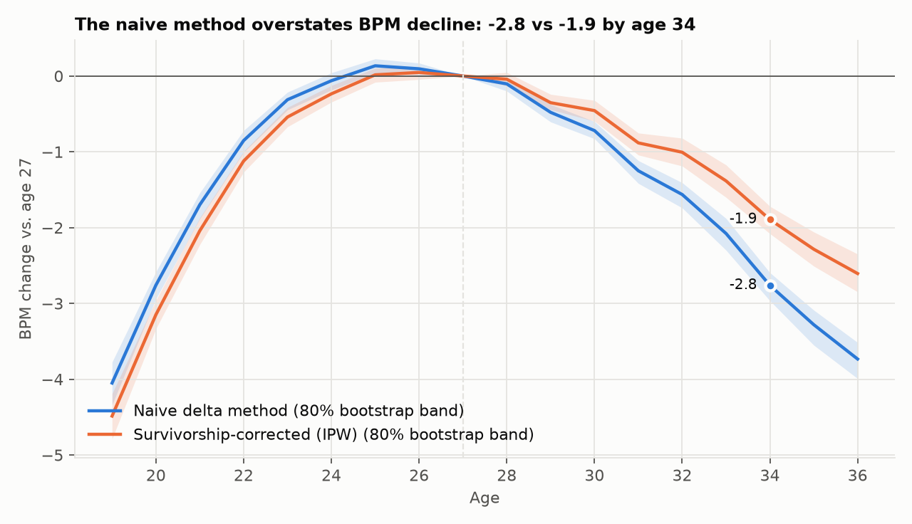
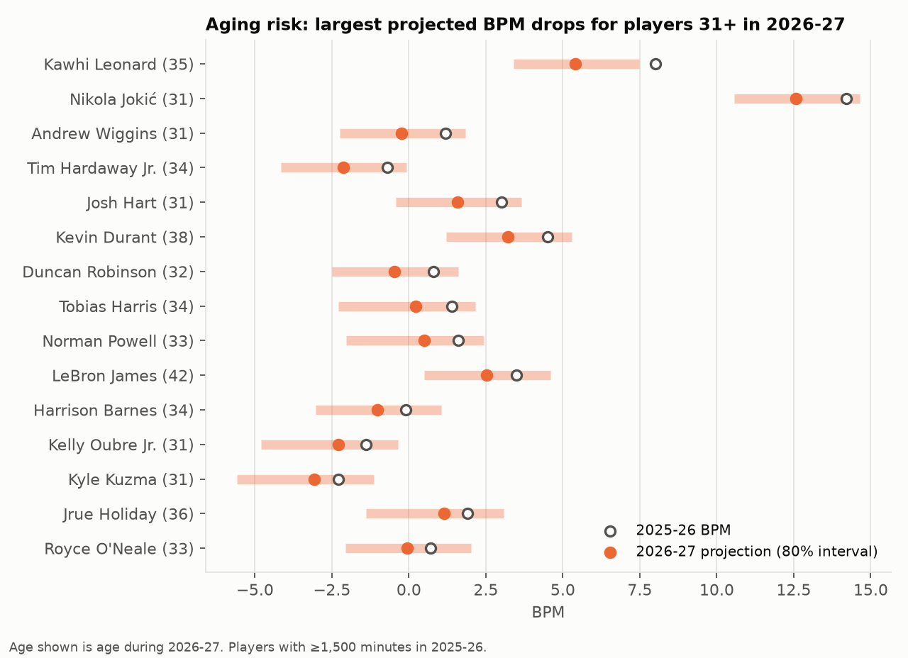

# Memo: How players age, and who is most at risk in 2026-27

**Question.** How much does a player's performance change as he ages, skill by skill, and what should we expect from each player next season?

## 1. The usual aging curve overstates decline

The common method compares each player's season to his next season and averages those changes by age. Its blind spot: a player only produces a "next season" if he stays in the league, and staying depends on how well he played this year. The players still around at 33 are disproportionately coming off good, partly lucky seasons. Some of that luck wears off the next year, and the common method counts it as aging.

After correcting for who stays and who leaves, **the average decline from age 27 to 34 is 1.9 points of BPM, not the 2.8 the usual method shows.** Late-career decline is real, but about a third smaller than the usual method says.

## 2. Skills age differently

- **Shooting holds up.** 3P% and FT% stay near their peak into the early 30s.
- **Players move away from the basket every year.** They take more threes and fewer shots at the rim throughout their careers.
- **Athletic skills fade first.** Steals peak around 23, blocks earlier still.
- **Playmaking, minutes and overall impact peak at 26–27.** From there they decline gradually, and faster after 32.

Practical read: a 31-year-old shooter keeps his main skill longer than a 31-year-old who relies on rim pressure or defensive activity.

## 3. Aging risk for 2026-27

Among players 31 and older who played at least 1,500 minutes last season, the largest projected BPM drops are Kawhi Leonard (35), Nikola Jokić (31), Andrew Wiggins (31), Tim Hardaway Jr. (34) and Josh Hart (31). Jokić is projected to remain one of the best players in the league. The projected drop is from a very high level, and most of it is an exceptional 2025-26 season regressing toward his multi-year average.

Each projection comes with an 80% range. A typical range is about ±2 BPM, which is wide. This model is good for ranking risk; it is not a precise forecast for any one player.

## 4. How much to trust it

I tested the method on four past seasons (2022-23 to 2025-26), each time using only data available before that season:

- It beat "assume he repeats last season" on 10 of 12 skills, with errors 2–19% lower.
- Its 80% ranges contained the real outcome 78.5% of the time. The uncertainty estimates are honest.
- A more complex statistical model (mixed effects) did worse on every skill, so I didn't use it.
- For shot selection (three-point rate, share of shots at the rim), "same as last season" was the best forecast. Players' shot habits barely move from year to year.

## 5. Limitations

- The correction accounts for what we can measure: age, performance and minutes. It can't see an unreported injury.
- BPM is built from box-score stats and misses much of defense.
- A player who sits out a season is treated as having left the league.

## 6. Next steps

1. Attach contract data to turn "projected decline" into "projected overpay."
2. Extend to 2–3-season projections, where the survivorship correction matters most.
3. Add a shot-quality model to separate shooting skill from shot selection.
